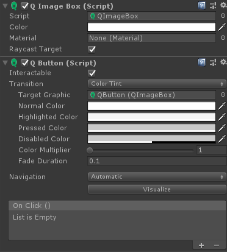

# UGUI自动化--QButton&QToggleButton&QToggleButtonGroup

本系列来自https://github.com/onelei/Lemon/tree/master/Assets/QGUI 今天接着介绍UGUI自动化中的Button和ToggleButton控件，相信读了前几篇文章的渐渐理解了设计思路。QButton继承自UGUI的Button组件，QToggleButton是自己设计的组件和UGUI的ToggleButton功能一样但是增加了回调函数的代码设置。同样的QToggleButtonGroup组件也是自己设计用来实现动态设置选中了某一个ToggleButton的功能以及选中之后的回调函数。说到这里可能会比较疑惑，接下来详细介绍如何使用。

## QButton



QButton组件比较简单，就是针对UGUI的Button按钮的封装。同时挂上没有Overdraw的QImageBox组件（QImageBox可以翻阅之前的文章有介绍）。

## QButton组件

新建一个QButton.cs代码如下

```
/**
*   Author：onelei
*   Copyright © 2019 - 2020 ONELEI. All Rights Reserved
*/
using UnityEngine;
using UnityEngine.UI;

namespace Lemon.UI
{
    [AddComponentMenu("UI/QButton")]
    public class QButton : Button
    {
        [HideInInspector]
        public bool bInit = false;

        private GameObject _CacheGameObject = null;
        public GameObject CacheGameObject { get { if (_CacheGameObject == null) { _CacheGameObject = gameObject; } return _CacheGameObject; } }

        private Transform _CacheTransform = null;
        public Transform CacheTransform { get { if (_CacheTransform == null) { _CacheTransform = transform; } return _CacheTransform; } }
    }
}
```

接着我们新建一个QButtonEditor.cs的脚本，将其放入Editor文件夹下。代码如下

```
/**
*   Author：onelei
*   Copyright © 2019 - 2020 ONELEI. All Rights Reserved
*/
using UnityEditor;
using UnityEngine;
using UnityEngine.UI;

namespace Lemon.UI
{
    [RequireComponent(typeof(QImageBox))]
    [CustomEditor(typeof(QButton), true)]
    public class QButtonEditor : UnityEditor.UI.ButtonEditor
    {
        [MenuItem("GameObject/UI/QButton", false, UtilEditor.Priority_QButton)]
        public static QButton AddComponent()
        {
            QImageBox image = UtilEditor.ExtensionComponentWhenCreate<QImageBox>(typeof(QButton).Name.ToString());
            QButton component = Util.GetOrAddCompoment<QButton>(image.gameObject);
            //设置默认值
            SetDefaultValue(component);
            return component;
        }

        QButton component;
        public override void OnInspectorGUI()
        {
            component = (QButton)target;
            base.OnInspectorGUI();
            if (!component.bInit)
            {
                component.bInit = true;
                SetDefaultValue(component);
            }
        }

        private static void SetDefaultValue(QButton component)
        {
            if (component == null)
                return;
            if (component.targetGraphic != null)
                component.targetGraphic.raycastTarget = true;
        } 
    }
}
```

同样我们通过SetDefaultValue函数来重写Button组件里面的参数。这个比较简单，但是接下来我们看看QToggleButton组件是如何设计的。

## QToggleButton


QToggleButton组件顾名思义就是用于按钮的切换。比如我们遇到的音量的on/off开关。QToggleButton组件挂在最上层，同时挂上没有Overdraw的QImageBox组件（QImageBox可以翻阅之前的文章有介绍）。箭头所指的Normal和Choose按钮就是用来切换显示使用的，既然有了切换显示功能，当然还需要有切换之后的回调函数的设置功能，详情如下。

## QToggleButton组件

新建一个QToggleButton.cs代码如下

```
/**
*   Author：onelei
*   Copyright © 2019 - 2020 ONELEI. All Rights Reserved
*/
using UnityEngine;
using UnityEngine.UI;
using System;

namespace Lemon.UI
{
    [AddComponentMenu("UI/QToggleButton")]
    public class QToggleButton : QButton
    {
        public GameObject Normal;
        public GameObject Choose;

        //Group
        private int index = -1;
        private int curIndex = -1;
        private Action<int, int> OnGroupAction = null;
        private bool bGroup = false;
        //Toggle
        private Action<bool> OnToggleAction;

        private bool bChoose = false;

        public void SetData(bool bChoose, Action<bool> OnToggleAction, bool doAction = false)
        {
            this.bGroup = false;
            this.OnToggleAction = OnToggleAction;
            SetChoose(bChoose);
            if (doAction)
            {
                OnToggleAction(bChoose);
            }
            this.onClick.RemoveListener(ClickEvent);
            this.onClick.AddListener(ClickEvent);
        }

        public void SetGroupData(int index, int curIndex, Action<int, int> OnGroupAction)
        {
            this.bGroup = true;
            this.index = index;
            this.curIndex = curIndex;
            this.OnGroupAction = OnGroupAction;

            SetChoose(curIndex == index);
            this.onClick.RemoveListener(ClickEvent);
            this.onClick.AddListener(ClickEvent);
        }

        public void SetChoose(int _index)
        {
            this.curIndex = _index;
            SetChoose(curIndex == index);
        }

        public void SetChoose(bool bChoose)
        {
            this.bChoose = bChoose;

            if (Normal != null)
            {
                Normal.SetActive(!bChoose);
            }
            if (Choose != null)
            {
                Choose.SetActive(bChoose);
            }
        }

        private void ClickEvent()
        {
            if (bGroup)
            {
                if (index == curIndex)
                    return;
                if (OnGroupAction != null)
                {
                    OnGroupAction(curIndex, index);
                }
            }
            else
            {
                SetChoose(!bChoose);
                if (OnToggleAction != null)
                {
                    OnToggleAction(bChoose);
                }
                QLog.LogEditor("当前bChoose: " + bChoose);
            }
        }

#if UNITY_EDITOR
        [ContextMenu("SetToggleEditor")]
        public void SetToggleEditor(bool bChoose = false)
        {
            this.bChoose = bChoose;
            SetData(bChoose, null);
        }
#endif
    }
}
```

脚本里面有一个函数SetData

```
public void SetData(bool bChoose, Action<bool> OnToggleAction, bool doAction = false)
        {
            this.bGroup = false;
            this.OnToggleAction = OnToggleAction;
            SetChoose(bChoose);
            if (doAction)
            {
                OnToggleAction(bChoose);
            }
            this.onClick.RemoveListener(ClickEvent);
            this.onClick.AddListener(ClickEvent);
        }
```

参数1：bChoose为true的时候表明切换为Choose状态，为false表明切换为Normal状态

参数2：OnToggleAction是传入的回调函数。当玩家点击了QToggleButton的时候会自动触发。里面的bool参数也会设置上。true表明Choose状态，false表明Normal状态。

参数3：doAction表明当前是否执行回调函数。默认为false，表明当前不执行回调函数。

接着我们新建一个QToggleButtonEditor.cs的脚本，将其放入Editor文件夹下。代码如下

```
/**
*   Author：onelei
*   Copyright © 2019 - 2020 ONELEI. All Rights Reserved
*/
using UnityEditor;
using UnityEngine.UI;
using UnityEngine;

namespace Lemon.UI
{
    [RequireComponent(typeof(QImageBox))]
    [CustomEditor(typeof(QToggleButton), true)]
    public class QToggleButtonEditor : QButtonEditor
    {
        [MenuItem("GameObject/UI/QToggleButton", false, UtilEditor.Priority_QToggleButton)]
        public static new QToggleButton AddComponent()
        {
            QImageBox image = QImageBoxEditor.AddComponent();
            image.raycastTarget = true;

            QToggleButton component = Util.GetOrAddCompoment<QToggleButton>(image.CacheGameObject);
            component.name = typeof(QToggleButton).Name.ToString();
            //设置默认值
            SetDefaultValue(component);
            return component;
        }

        QToggleButton component;
        public override void OnInspectorGUI()
        {
            component = (QToggleButton)target;
            component.Normal = (GameObject)EditorGUILayout.ObjectField("Normal", component.Normal, typeof(GameObject), true);
            component.Choose = (GameObject)EditorGUILayout.ObjectField("Choose", component.Choose, typeof(GameObject), true);

            GUILayout.BeginHorizontal();
            if (GUILayout.Button("Normal"))
            {
                component.SetToggleEditor();
            }
            if (GUILayout.Button("Choose"))
            {
                component.SetToggleEditor(true);
            }
            GUILayout.EndHorizontal();

            //base.OnInspectorGUI();
            if (!component.bInit)
            {
                component.bInit = true;
                SetDefaultValue(component);
            }
        }

        private static void SetDefaultValue(QToggleButton component)
        {
            if (component == null)
                return;
            if (component.targetGraphic != null)
                component.targetGraphic.raycastTarget = true;
            component.SetToggleEditor();
        }
    }
}
```

QToggleButton是用来控制一个按钮的切换状态，但是当我们需要多个按钮互斥显示的时候，类似于UGUI的ToggleGroup，该如何处理呢？接着往下看。

## QToggleButtonGroup


我们通过一个index表明当前是选中了第几个按钮，图中的按钮Choose表明立刻设置选中。编辑器下面index可以通过Choose按钮动态设置。

## QToggleButtonGroup组件

新建一个QToggleButtonGroup.cs代码如下

```
/**
*   Author：onelei
*   Copyright © 2019 - 2020 ONELEI. All Rights Reserved
*/
using UnityEngine;
using UnityEngine.UI;
using System;
using System.Collections.Generic;

namespace Lemon.UI
{
    [AddComponentMenu("UI/QToggleButtonGroup")]
    public class QToggleButtonGroup : BaseMonoClass
    {
        [SerializeField]
        public List<QToggleButton> list = new List<QToggleButton>();

        //内部变量
        private int pre;
        private int cur;
        private Action<int, int> OnGroupAction;

        public void SetData(int index, Action<int, int> OnGroupAction, bool doAction = false)
        {
            this.pre = -1;
            this.cur = -1;

            this.cur = index;
            this.OnGroupAction = OnGroupAction;

            int length = list.Count;
            for (int i = 0; i < length; i++)
            {
                QToggleButton toggleButton = list[i];
                toggleButton.SetGroupData(i, index, OnGroup);
            }

            if (doAction)
            {
                OnGroup(pre, cur);
            }
        }

        public void OnGroup(int pre, int cur)
        {
            QLog.LogEditor(StringPool.Format("点击pre = {0}, cur = {1}.", pre, cur));

            //设置所有组件的显示隐藏
            int length = list.Count;
            for (int i = 0; i < length; i++)
            {
                QToggleButton toggleButton = list[i];
                toggleButton.SetChoose(cur);
            }

            //设置组件的回调函数
            if (OnGroupAction != null)
            {
                OnGroupAction(pre, cur);
            }
        }

#if UNITY_EDITOR
        [ContextMenu("SetToggleGroupEditor")]
        public void SetToggleGroupEditor(int index = 0)
        {
            SetData(index, null);
        }
#endif
    }
} 
```

在这里我们同样增加了SetData这样一个函数

```
public void SetData(int index, Action<int, int> OnGroupAction, bool doAction = false)
        {
            this.pre = -1;
            this.cur = -1;

            this.cur = index;
            this.OnGroupAction = OnGroupAction;

            int length = list.Count;
            for (int i = 0; i < length; i++)
            {
                QToggleButton toggleButton = list[i];
                toggleButton.SetGroupData(i, index, OnGroup);
            }

            if (doAction)
            {
                OnGroup(pre, cur);
            }
        }
```

参数1：index表明当前是选中了第几个按钮。

参数2：OnGroupAction是当玩家选中这些互斥按钮时候的回调函数。第一个int是之前选中的index，第二个int是

当前选中的index。

参数3：doAction表明当前是否执行回调函数。默认为false，表明当前不执行回调函数。

接着我们新建一个QToggleButtonGroupEditor.cs的脚本，将其放入Editor文件夹下。代码如下

```
/**
*   Author：onelei
*   Copyright © 2019 - 2020 ONELEI. All Rights Reserved
*/
using UnityEditor;
using UnityEngine;
using UnityEngine.UI;

namespace Lemon.UI
{
    [CustomEditor(typeof(QToggleButtonGroup))]
    public class QToggleButtonGroupEditor : Editor
    {
        [MenuItem("GameObject/UI/QToggleButtonGroup", false, UtilEditor.Priority_QToggleButtonGroup)]
        public static QToggleButtonGroup AddComponent()
        {
            QToggleButtonGroup component = UtilEditor.ExtensionComponentWhenCreate<QToggleButtonGroup>(typeof(QToggleButtonGroup).Name.ToString());
            component.list.Clear();

            for (int i = 0; i < 2; i++)
            {
                Selection.activeObject = component;
                QToggleButton button = QToggleButtonEditor.AddComponent();
                component.list.Add(button);
            }
            Selection.activeObject = component;
            return component;
        }

        QToggleButtonGroup component;
        int index = 0; 
        public override void OnInspectorGUI()
        { 
            component = (QToggleButtonGroup)target;
            GUILayout.BeginHorizontal();
            index = EditorGUILayout.IntField("index", index);
            if (GUILayout.Button("Choose"))
            {
                component.SetToggleGroupEditor(index);
            }
            GUILayout.EndHorizontal();

            base.OnInspectorGUI();
        }
    }
} 
```

详细代码参见：https://github.com/onelei/Lemon/tree/master/Assets/QGUI，欢迎Star。如果本文对你有所帮助，欢迎赞赏~~~

